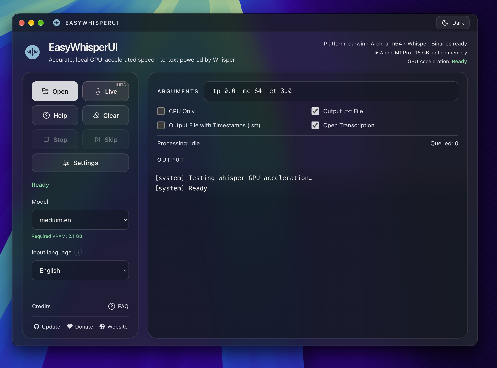
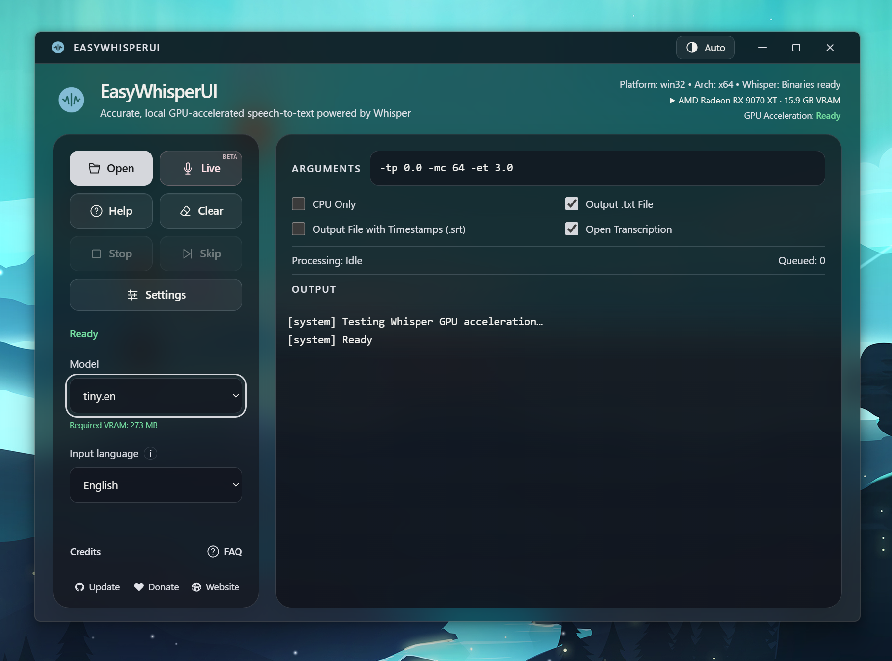

# EasyWhisperUI


Transcribe audio and video locally with Whisper, with GPU acceleration on supported hardware.

[](https://www.paypal.com/donate/?business=5FM6Y27A3CK58&no_recurring=0&currency_code=USD)

## Download

| Platform | Requirements | Download |
| --- | --- | --- |
| Windows | Windows 10/11, x64 | [3.1.0 installer](https://github.com/mehtabmahir/easy-whisper-ui/releases/download/v3.1/EasyWhisperUI-Setup-3.1.0-win-x64.exe) |
| macOS | macOS 13+, Apple Silicon | [3.1.0 DMG](https://github.com/mehtabmahir/easy-whisper-ui/releases/download/v3.1/EasyWhisperUI-3.1.0-macOS-arm64.dmg) |
| Linux | Beta; tested on Ubuntu | 3.1 pending; [previous releases](https://github.com/mehtabmahir/easy-whisper-ui/releases) |

Windows uses Vulkan on supported GPUs; macOS uses Metal. CPU-only processing is also available.

[Release notes](https://github.com/mehtabmahir/easy-whisper-ui/releases/tag/v3.1)

<table>
  <tr>
    <th width="50%">macOS</th>
    <th width="50%">Windows</th>
  </tr>
  <tr>
    <td><a href="resources/preview-macos.png"></a></td>
    <td><a href="resources/preview-windows.png"></a></td>
  </tr>
</table>

## Features

- **Private, local transcription** — turn audio and video into text on your own computer.
- **GPU acceleration** — Vulkan on Windows and Metal on Apple Silicon, with automatic verification and a CPU-only option.
- **Languages and subtitles** — multilingual transcription, translation into English, and TXT/SRT exports.
- **Batch processing** — drag in multiple files, skip individual items, or stop the queue.
- **Live transcription** — transcribe microphone audio in real time (beta).
- **Model choice** — download, manage, or load custom models, with color-coded memory estimates.
- **Clear download progress** — see size, speed and time remaining, and cancel downloads when needed.
- **Light, Dark and Auto themes** — translucent backgrounds and a spacious output console.
- **Faster retries** — cached audio avoids repeated conversion when retrying or changing models.
- **Simple setup and repair** — guided installation and clean reinstall on Windows/Linux, preserving models and settings.
- **Advanced controls** — extra Whisper arguments, built-in CLI help, and accessible setup logs.

## Quick start

1. Run the Windows installer, or open the Mac DMG and drag **EasyWhisperUI** into **Applications**.
2. Launch the app and let initial setup finish. macOS includes Whisper and FFmpeg.
3. Choose your model, input language, and output formats. New users start with `tiny.en`; existing selections are preserved. Use a multilingual model for non-English audio; `.en` models are English-only. Missing models download automatically. For a local model, choose **custom → Select Model File**.
4. Click **Open** or drop files into the window. Transcription starts automatically; exports are saved beside the original files.

To translate into English, choose a multilingual model such as `medium`, select the source language, and add `--translate` in **Arguments**.

Clearing the audio cache leaves original files and exported transcripts untouched.

## FAQ

- **How can I use my transcript?** Give the TXT file to your favorite LLM for summaries, study notes, or a cleaned-up transcript. Export SRT to add subtitles in a video editor or player.
- **Where are exports saved?** Beside the original audio or video.
- **Why isn't it working?** On Windows/Linux, try **Settings → Clean reinstall**. On Mac, restart the app. If it still fails, use **Settings → Show log file** and [submit an issue](https://github.com/mehtabmahir/easy-whisper-ui/issues/new) with the error, log, OS, CPU, GPU, RAM, app version, and model. If no setup log exists, copy the console error.

The in-app **FAQ** button sits above Update, Donate, and Website. **Help** displays Whisper CLI options.

## Troubleshooting

The Mac app is ad-hoc signed and not notarized. If macOS blocks it, try **System Settings → Privacy & Security → Open Anyway**. For a “damaged” message, follow the [release's first-opening instructions](https://github.com/mehtabmahir/easy-whisper-ui/releases/tag/v3.1#macos-first-opening).

For other problems, [open an issue](https://github.com/mehtabmahir/easy-whisper-ui/issues) with your OS, selected model, and console logs.

## Development

Requires Node.js 22.12+; Node.js 24 is recommended. Mac builds also require Homebrew and Xcode Command Line Tools. Clone with submodules, then:

```bash
cd electron
npm install
npm run dev
```

Use `npm run dist` to package the app into `build/electron-dist` at the repository root. See the [developer README](electron/README.md) for architecture and platform setup.

## Support

I'm a solo developer, and countless hours went into refining EasyWhisperUI. **Donations are the project's only source of funding.** If you find it useful, please consider supporting continued development.

[](https://www.paypal.com/donate/?business=5FM6Y27A3CK58&no_recurring=0&currency_code=USD)

Thank you to my supporters:

- Craig H — $50
- Eric De Vet — $10
- Jan P — $5
- Minh P — $5
- Rödvarg R — $2

## Credits

[whisper.cpp](https://github.com/ggerganov/whisper.cpp) by Georgi Gerganov · [FFmpeg](https://ffmpeg.org) · [Windows FFmpeg builds](https://github.com/BtbN/FFmpeg-Builds) · [macOS FFmpeg builds](https://ffmpeg.martin-riedl.de/) · [SDL2](https://www.libsdl.org/) · [electron-builder](https://www.electron.build/)

## License

```text
Copyright (c) 2026 Mehtab Mahir
All rights reserved.

This software is proprietary and the following is not allowed for commercial purposes:
it may not be copied, modified, distributed, or used without explicit permission from the author.

Those actions are permitted for personal use ONLY.

This application includes the following open-source components:

---

whisper.cpp by Georgi Gerganov
License: MIT
[https://github.com/ggerganov/whisper.cpp](https://github.com/ggerganov/whisper.cpp)

---

FFmpeg
License: depends on the build; the bundled macOS binary is GPL 3.0 or later.
Windows setup downloads a GPL build from BtbN.
[https://ffmpeg.org](https://ffmpeg.org)
Windows builds: https://github.com/BtbN/FFmpeg-Builds
macOS builds: https://ffmpeg.martin-riedl.de/

The FFmpeg binary is provided as a separate file and may be replaced with a compatible version.

---

SDL2 (bundled on macOS)
License: zlib
https://www.libsdl.org/
```
